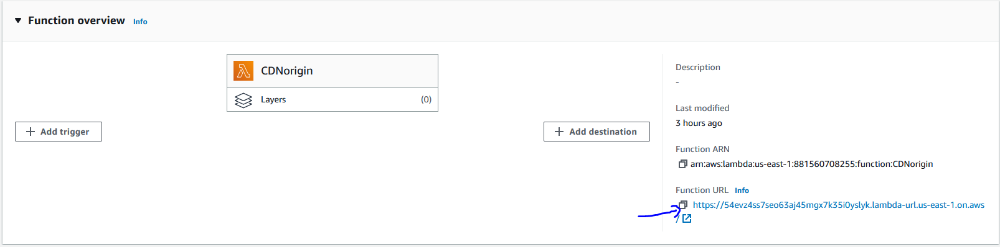
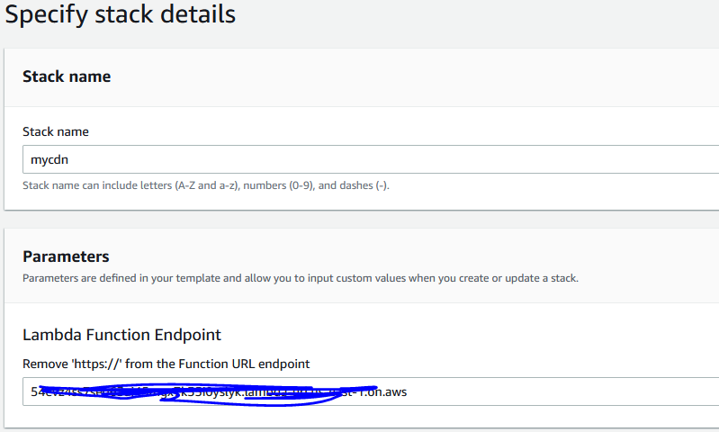
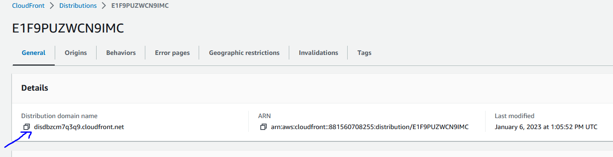

# Access Lyve Cloud S3 media contents through Amazon CloudFront

## Introduction
The following document will explain how to integrate Amazon CloudFront with AWS Lambda as origin to access the media contents from Lyve Cloud S3.

Fronting Lyve Cloud S3 media contents with Lambda and CloudFront allows you to cache content closer to the viewer by leveraging the globally distributed content distribution network. 

You could define custom domain names, turn on HTTPS delivery over TLS. Further, you could activate AWS Web Application Firewall (WAF) and AWS Shield Advanced to protect your application from malicious bots, prevent common application exploits and enhance protection from DDoS attacks. 

Amazon CloudFront and Lyve Cloud S3 Object Storage are used together to improve the delivery and security of your mission critical applications. When a user requests for content through CloudFront, the request is routed to the edge location that provides the lowest latency and is delivered with optimal performance.

## How It Works
The AWS Lambda function provided in this repository returns, upon request, the content of the specified S3 object and its content type. When accessed via a CloudFront URL, the content is retrieved from CloudFront's cache, rather than performing an additional GET operation to retrieve the object from Lyve Cloud's storage.

## Architecture 
The sequence diagram below shows how the high level data flow looks like.
<p style="text-align:left"></p>

 
## Requirements
* Lyve Cloud
  * Access Key
  * Secret Key
  * S3 API Endpoint
  * Name of the bucket that contains files to view
* AWS Account
  * IAM
  * Lambda
  * CloudFront
  * CloudFormation

## Running Steps
### Step 1: Create IAM Role for AWS Service execution.
1. Login to AWS Console and navigate to `IAM` dashboard.
2. Navigate to `Roles` in the left panel under `Access Management`.
3. Click on **Create Role**. 
4. Select `AWS service` under **Trusted entity type** and `Lambda` under **Use case** and click on **Next**.
5. Select policy `AWSLambdaBasicExecutionRole` and click on **Next**.
6. Give a name to the policy under **Role name** and click on **Create role**.

### Step 2: Create Lambda Function and Obtain the Function URL.
1. Navigate to the AWS Lambda console in the AWS Region you want to deploy the function.
2. Click on **Create function**.
3. Provide the Function name and select `Python 3.9` under **Runtime**.  
4. Under **Permissions** click on **Change default execution role**, select **Use an existing role** and choose the role that we created in the previous step.
5. Under **Advanced settings**, check the `Enable function URL` field. Since the Lambda function needs to be publicly accessible select `NONE` for Auth type. This also creates the necessary resource-based policies to allow public access to the function.
5. Click **Creation function** to finish the function creation setup.
6. Click on the **Configuration** tab and navigate to **Environmental variables** tab on left panel. 
7. Clock on **edit** and add the following environmental variables and its respective values:

  | Key  | Value |
  | ------------- | ------------- |
  | ACCESS_KEY  | Access Key to the Lyve Cloud S3 API  |
  | SECRET_KEY  | Secret Key to the Lyve Cloud S3 API  |
  | ENDPOINT  | Lyve Cloud S3 Endpoint URL  |
  | BUCKET_NAME  | Name of the bucket that contains the object that you want to distribute  |
  | OBJECT_KEY  | Name of the object that will be distributed  |

8. Navigate back to **Code**, copy and paste the contents of [LyveS3PresignedURL.py](code/s3_object_reader.py) into the Code source section.
9. Note down the Lambda Function URL as shown in below figure.
  <p style="text-align:left"></p>

### Step 3: Create the Amazon CloudFront configuration.
1. Navigate to **CloudFormation** service and click on **Create Stack**.
2. Under **Prerequisite - Prepare template** opt for the option 'Template is Ready'. 
3. Under **Specify template** select **Upload a template file**, click on **Choose File** and choose [CFT_Cloudfront.yml](code/CFT_Cloudfront.yml). Click on **Next**.
4. Under **Lambda Function Endpoint** enter the function URL obtained earlier as shown in below screenshot.
     <p style="text-align:left"></p>
     Remove https:// and trailing slash from the Function URL while providing the input.
5. Once the CloudFormation template is deployed, navigate to the **Outputs** tab of the CloudFormation stack to access the default CloudFront domain name created. You should see the object that you stored in your bucket when the distribution domain is accessed through browser.
    <p style="text-align:left"></p>
     

## Results 
Hit the CloudFront URL your local browser and you will see the media file that stored in Lyve S3.
<p style="text-align:left"></p>


## Tested by
* Jan 6, 2023: Rahul Gode (rahul.gode@seagate.com)
* month day, year: full_name (email) on your_environment

## **Note:** All files should be uploaded (all the files you used for the integration solution) under one folder, including the README.md file. 
### Project Structure

This section will describe the representation of each of the folders or files in the structure.
```
.
├── README.md
├── code
│   └── css
        lyves3browser.css
│   └── js
        lyves3browser.js
        libs
└── images
    └── cloudfront.PNG
        cloudfront_url.PNG
        result.PNG
        data_flow.PNG
        lambda_url.PNG
        variables.PNG
```

### `/code`
This folder contains all the code files.

### `/images`
This folder contains all the images.
